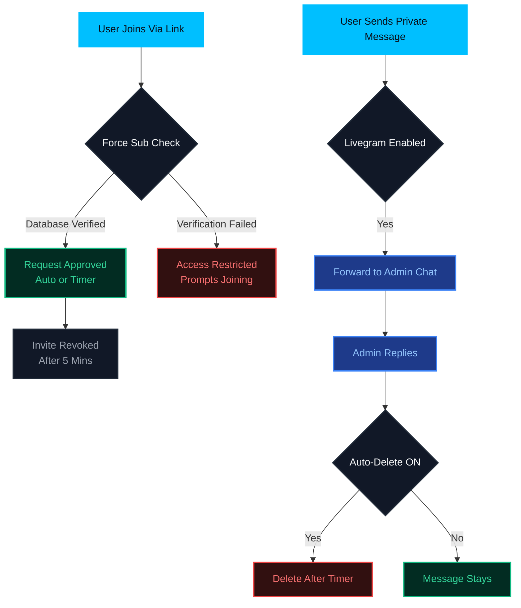

<p align="center">
  <a href="https://github.com/Unrated-Coder/Unrated-LinkShare-ot" target="_blank">
    
  </a>
</p>

<p align="center">
  
</p>

<p align="center">
  <strong>An ultra-high-performance, native Telegram link sharing and channel management engine powered by Pyrofork (Pyrogram v2).</strong>
</p>

<p align="center">
  <a href="https://t.me/Unrated_Coder"></a>
  <a href="https://t.me/Unrated_Coder"></a>
  
  
</p>

<p align="center">
  • <a href="#overview">Overview</a> •
  <a href="#core-capabilities">Capabilities</a> •
  <a href="#livegram-feedback-system">Livegram</a> •
  <a href="#system-workflow">Workflow</a> •
  <a href="#command-console">Console</a> •
  <a href="#environment-configuration">Configuration</a> •
  <a href="#local-installation">Installation</a> •
  <a href="#docker-deployment">Docker</a> •
  <a href="#instant-deployment">Deployment</a> •
</p>

<hr/>

## Overview

**LinkShareBot** is an enterprise-grade, high-performance Telegram native automation assistant designed to manage, store, and distribute Telegram channel links seamlessly.

Powered by **Pyrofork (Pyrogram)**, it secures your community traffic by automatically generating, monitoring, and revoking invite links. It features advanced utilities like Force Subscription gating, bulk generation pipelines, automated join-request approval engines, and a full **Livegram-style private feedback system** with content protection & auto-delete.

---

## Core Capabilities

*   🌐 **Multi-Channel Indexing** — Register, monitor, and manage unlimited Telegram channels dynamically in a single unified database.
*   🔒 **Secure Auto-Invites** — Generate secure, custom single-use invite links on-the-fly to prevent unauthorized link sharing.
*   ⏱️ **Self-Revoking Links** — Enhanced link protection that automatically revokes and invalidates generated links after 5 minutes.
*   📦 **Bulk Generation** — Mass-generate custom invite links for multiple target channel IDs instantly in a single command execution.
*   📋 **Paginated Navigation** — Smooth, lag-free pagination using inline keyboards for effortless navigation through large channel lists.
*   🔄 **Request Queue Manager** — Direct support for Join Request links with automated request monitoring.
*   🛡️ **Force-Subscribe (FSub)** — Gate bot access by strictly requiring users to join your specified channels or request pools first.
*   📊 **Analytics Dashboard** — Live system diagnostics, total active users, and database analytics at your fingertips.
*   💬 **Livegram Feedback System** — Users DM the bot → messages forwarded to admin → admin replies back (Livegram-style).
*   🗑️ **Auto-Delete Replies** — Admin replies to users can be scheduled to auto-delete after a custom timer.
*   🔐 **Protected Content** — Prevent users from forwarding, saving, or copying admin replies with a single toggle.
*   🧠 **Persistent Settings** — All feedback settings (timer, protection, admin chat) stored in MongoDB and survive restarts.

---

## Livegram Feedback System

A full **Livegram-style anonymous support system** built into the bot. Users can message the bot privately — their messages are forwarded to the admin (or a designated group), and the admin replies by simply replying to the forwarded message.

### Supported Content Types

Every media type is forwarded automatically: **Text · Photo · Video · Audio · Voice · Document · Animation · Sticker · Video Note · Contact · Location · Poll**

### What the Admin Sees

```
📩 ɴᴇᴡ ᴍᴇꜱꜱᴀɢᴇ ꜰʀᴏᴍ ᴜꜱᴇʀ

👤 ɴᴀᴍᴇ: John Doe
🆔 ᴜꜱᴇʀ ɪᴅ: 123456789
🔗 ᴜꜱᴇʀɴᴀᴍᴇ: @johndoe
🌎 ᴅᴄ: 2

↩️ Reply to the message below to respond.
```

### Key Features

| Feature | Description |
| :--- | :--- |
| **Anonymous Routing** | User identity is hidden from other users; only the admin sees details |
| **All Media Types** | Text, photo, video, voice, document, animation, sticker, poll, location — everything works |
| **Group Support** | Route feedback to a support group instead of the owner's DM |
| **Auto-Delete Timer** | Admin replies can auto-delete after a set time (great for QR codes, expiring links) |
| **Content Protection** | Prevent users from forwarding, saving, or copying admin replies |
| **Crash-Safe** | Settings stored in MongoDB → persist even after bot restart |

### Admin Commands

| Command | Description |
| :--- | :--- |
| `/feedback` | Show feedback system status & help |
| `/feedback on` | Enable the feedback system |
| `/feedback off` | Disable the feedback system |
| `/feedback set <chat_id>` | Route feedback to a specific group/channel |
| `/feedback status` | Show current status & admin chat |
| `/livegram_autodelete <seconds>` | Set auto-delete timer for admin replies |
| `/livegram_autodelete off` | Disable auto-delete |
| `/livegram_autodelete` | Show current auto-delete timer |
| `/livegram_rstrmsg on` | 🔒 Enable content protection (anti-forward/save) |
| `/livegram_rstrmsg off` | 🔓 Disable content protection |
| `/livegram_rstrmsg` | Show current protection status |

### Example Workflows

**📱 Sending an expiring QR code:**

```
/livegram_autodelete 120
/livegram_rstrmsg on
```

→ Reply to user's message with QR code
→ QR deletes itself after 2 minutes
→ User can't forward or save it

**👥 Setting up a support group inbox:**

1. Add the bot to your support group as admin
2. Send `/feedback set -100xxxxxxxxxx`
3. All user messages now route to the group
4. Any admin in the group can reply to forward the reply back

---

## System Workflow



---

## Command Console

<details>
<summary><b>📅 Channel & Link Management (Admins Only)</b></summary>
<br>

*   `/addch <channel_id>` or `/addchat <channel_id>` — Registers a new target channel into the central database.
*   `/delch <channel_id>` or `/delchat <channel_id>` — Removes a registered channel from the database.
*   `/channels` — Displays connected channels with ID and Name (paginated).
*   `/ch_links` — Launches the paginated interactive channel list with inline navigation.
*   `/reqlink` — Displays active join-request links for connected channels with inline navigation.
*   `/links` — Outputs all generated active channel links as a clean list format with pagination.
*   `/bulklink <id1> <id2> ...` — Mass generates invite links for multiple channels instantly.
*   `/genlink <link>` — Encodes and stores a custom link in the database channel and database, returning normal and request links.

</details>

<details>
<summary><b>💬 Livegram Feedback System (Admins Only)</b></summary>
<br>

**Core Commands:**

*   `/feedback` — Show feedback system status & help menu.
*   `/feedback on` — Enable the Livegram-style feedback system.
*   `/feedback off` — Disable the feedback system.
*   `/feedback set <chat_id>` — Route incoming user messages to a specific group/channel (great for support groups).
*   `/feedback status` — Show current status, admin chat, and enabled state.

**Auto-Delete Timer:**

*   `/livegram_autodelete <seconds>` — Set auto-delete timer for admin replies (min 5s, max 86400s).
*   `/livegram_autodelete off` — Disable auto-delete (messages stay forever).
*   `/livegram_autodelete` — Show current timer.

**Content Protection:**

*   `/livegram_rstrmsg on` — 🔒 Enable content protection (users can't forward, save, or copy).
*   `/livegram_rstrmsg off` — 🔓 Disable content protection.
*   `/livegram_rstrmsg` — Show current protection status.

</details>

<details>
<summary><b>⏱️ Auto-Approval Engine</b></summary>
<br>

*   `/reqtime <seconds>` — Sets the custom sleep delay before automatically approving join requests.
*   `/reqmode <on/off>` — Toggles the Auto Request Approval system state [`on` / `off`].
*   `/approveon <channel_id>` — Enables automated request approval for a specific channel.
*   `/approveoff <channel_id>` — Disables automated request approval for a specific channel.

</details>

<details>
<summary><b>🛡️ Force Subscription (FSub) Gate</b></summary>
<br>

*   `/add_fsub <channel_id> <mode>` — Configures a channel for Force-Sub (Modes: `normal`, `request`).
*   `/fsub` — Lists all channels currently active in the FSub gatekeeper.
*   `/del_fsub <channel_id>` — Disables FSub requirement for a channel.

</details>

<details>
<summary><b>👮 Admin Management (Owner Only)</b></summary>
<br>

*   `/addadmin <user_id>` — Adds a user to the administrators list.
*   `/deladmin <user_id>` — Removes a user from the administrators list.
*   `/admins` — Lists all registered custom administrator user IDs.

</details>

<details>
<summary><b>📊 System & Admin Utilities (Admins Only)</b></summary>
<br>

*   `/stats` — (Owner only) Queries total active users and bot uptime.
*   `/status` — Queries live server metrics, ping, and bot uptime.
*   `/broadcast` — (Admin only) Dispatches a global push notification to all registered bot users with advanced modes (`pin`, `delete <seconds>`, `silent`).
*   `/cancel` — (Admin only) Cancels an active broadcast in progress.

</details>

---

## Environment Configuration

Configure the following environment variables inside your hosting platform settings or create a local `.env` file:

| Variable Name | Description / Value |
| :--- | :--- |
| `API_ID` / `APP_ID` | Your Telegram API ID obtained from [my.telegram.org](https://my.telegram.org) |
| `API_HASH` | Your Telegram API Hash obtained from [my.telegram.org](https://my.telegram.org) |
| `TG_BOT_TOKEN` | Your Telegram Bot Token obtained from [@BotFather](https://t.me/BotFather) |
| `OWNER_ID` | Telegram User ID of the primary bot owner |
| `ADMINS` | Space-separated list of authorized Admin User IDs (e.g., `123456 789012`) |
| `DB_URI` / `DB_URL` / `DATABASE_URL` | MongoDB Connection URI string (e.g., `mongodb+srv://...`) |
| `DB_NAME` | MongoDB database name (defaults to `Unrated-LinkShare-Bot` if not specified) |
| `DATABASE_CHANNEL` | Telegram Channel ID used for logging and database backups (e.g., `-100...`) |
| `PORT` | Web server port configuration (default: `8080` for Koyeb/Render binding) |
| `CHAT_ID` | Space/comma-separated list of Telegram Chat/Channel IDs for Auto Approval |
| `APPROVED_WELCOME` | Auto-Welcome status (`on` / `off`, default is `on`) |
| `APPROVED_WELCOME_TEXT` | Custom HTML welcome text message to send to auto-approved users |
| `TG_BOT_WORKERS` | Number of concurrent bot workers (default is `40`) |
| `START_PIC` / `START_IMG` | Link to the photo shown on the start message command |
| `START_MSG` | HTML custom starting message text |
| `HELP_MESSAGE` | HTML custom help message text |
| `ABOUT_MESSAGE` | HTML custom about message text |

---

## Local Installation

Follow these steps to deploy a development instance of the bot locally:

### Prerequisites

- Python 3.10 or higher
- MongoDB (running instance)
- Git installed on your system

```bash
# 1. Clone the repository
git clone https://github.com/Unrated-Coder/Unrated-LinkShare-Bot.git
cd Unrated-LinkShare-Bot

# 2. Initialize a Python Virtual Environment
python3 -m venv venv
source venv/bin/activate  # On Windows, use: venv\Scripts\activate

# 3. Install required library dependencies
pip3 install -r requirements.txt

# 4. Configure environmental keys
cp sample_config.env .env  # Rename and configure values inside .env file

# 5. Start the engine
python3 main.py
```

---

## Docker Deployment

For standardized production hosting, we highly recommend deploying via Docker containerization:

```bash
# Build the Docker image
docker build -t unrated-linkshare-bot .

# Run the container background daemon
docker run -d --name linkshare-bot --env-file .env unrated-linkshare-bot
```

---

## Instant Deployment

Deploy your custom instance of **LinkShareBot** directly to top cloud hosting platforms with a single click:

<p align="center">
  <a href="https://dashboard.heroku.com/new?template=https://github.com/Unrated-Coder/Unrated-LinkShare-Bot" target="_blank">
    
  </a>
  &nbsp;&nbsp;
  <a href="https://app.koyeb.com/deploy?type=git&repository=github.com/Unrated-Coder/Unrated-LinkShare-Bot&branch=main&name=unrated-linkshare-bot" target="_blank">
    
  </a>
  &nbsp;&nbsp;
  <a href="https://render.com/deploy?repo=https://github.com/Unrated-Coder/Unrated-LinkShare-Bot" target="_blank">
    
  </a>
</p>

---

<p align="center">
  Developed & maintained with ⚡️ by <a href="https://t.me/Unrated_Coder"><b>@Unrated_Coder</b></a> on Telegram
</p>
